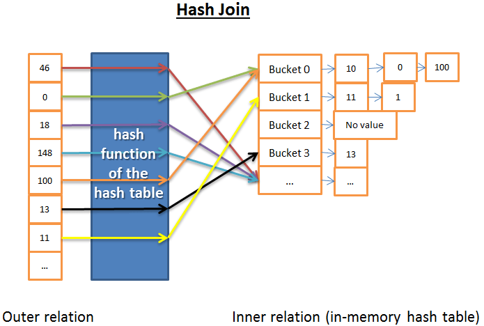
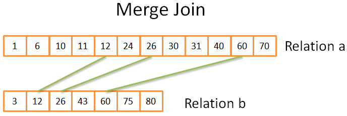

# 关系型数据库如何运行

当提到关系数据库，不由自主地认为缺少了些重要信息。这些数据库无所不在，发挥着他们的作用，他们包括了小巧的sqlite,强大的Teradat。但是少有文章去说明数据的运行原理。你可以搜索 “how does a relational database work”【关系数据库运行原理】来了解这样的文章有多么少。如果你去搜索现在这些流行技术（大数据，Nosql和javascript），你会找到大量深入的文章在说明这些技术的运行原理。关系数据库太不流行太没意思，以至于出了大学课堂，就找不到书和研究资料去阐明它的运行原理？ 

作为一个开发者，我非常不喜欢用一些我不理解的技术/组件。即使数据库已经经过了40年运用的检验，但是我依然不喜欢。这些年，我花费了上百小时的时间去研究这些每天都用的奇怪的黑匣子。**关系型数据库**的有趣也因为他门构建在**有效和重用的理念**上。如果你要了解数据库，而有没有时间或者没有毅力去了解这个宽泛的话题，那么你应该阅读这篇文章。 

虽然文章标题已经足够明确，**本文的目的不是让你学习怎么使用一个数据库**.但是,**你应该已经知道怎么写一个简单的连接查询和基本的增删改查的查询**，否则，你就不能明白本文。**这就是现在必须要知道**，我将解释为什么需要这些提前的知识。 

我将从时间复杂度开始开始这些计算机科学知识。当然当然，我晓得有些朋友不喜欢这些观点但是不了解这些，我们就不明白数据库中使用的技巧。这是一个庞大的话题，我将**聚焦于**非常必要的知识上，**数据库处理SQL查询的方法**。我将只涉及**数据库背后的基本观念**，让你在本文结束的时候**了解水面下发生了什么**。 

这是一篇又长又有技术性的文章，涉及了很多算法和数据结构，总之不怎么好理解，慢慢看吧同学。其有一些观点确实不容易理解，你把它跳过去也能得到一个比较全面的理解（译者注：这篇博文对于学习过《数据结构》的同学，不算是很难，即使有一些难以理解的观点，要涉及技术的特性，这是使用这些许技的原因，对应能够明白使用技术要达成的结果）。 

本文大体分为3个部分，为了方便理解：
*   底层技术和数据库模块
*   查询优化技术
*   事物和内存池管理

##总体结构

我们已经理解了数据库使用的基本组件。我们需要回头看看这个大结构图。 
数据库就是一个文件集合，而这里信息可以被方便读写和修改。通过一些文件，也可以达成相同的目的（便于读写和修改）。事实上，一些简单的数据库比如SQLite就仅仅使用了一些文件。但是SQLite是一些经过了良好设计的文件,因为它提供了以下功能： 
+   使用事务能够保证数据安全和一致性
+   即使处理百万计的数据也能高效处理

一般而言，数据库的结构如下图所示:
 

 
在开始写之前，我曾经看过很多的书和论文，而这些资料都从自己的方式来说明数据库。所以，清不要太过关注我怎么组织数据库的结构和对这些过程的命名，因为我选择了这些来配置文章的规划。不管这些不同模块有多不一样，但是他们总体的观点是**数据库被划分为多个相互交互的模块**。 

<u>核心模块:</u>
+  **进程管理器**: 很多的数据库都有进程/线程池需要管理，另外，为了达到纳秒级（切换），一些现代的数据库使用自己实现线程而不是系统线程。
+  **网络管理器**: 网络IO是一个大问题，尤其是分布式数据库。这就是一些数据库自己实现管理器的原因。
+  **文件系统管理器: 磁盘IO是数据库的第一性能瓶颈**。文件系统管理器太重要了，他要去完美使用OS文件系统，甚至自己取而代之。
+  **内存管理器**: 为了避免磁盘IO带来是惩罚，我们需要很大的内存。但是为了有效的使用这些内存，你需要一个有效率的内存管理器。尤其在多个耗内存的查询操作同时进行的时候。
+  **安全管理器**: 为了管理用户的验证和授权。
+  **客户端管理器**: 为了管理客户端连接..
+  .......

<u>工具类:</u>
+  **备份工具**: 保存和恢复一个数据库。
+  **恢复工具**: 使据据库在崩溃重启之后，重新达到一致性的状态。
+  **监控工具**: 记录数据库所有的行为，需要提供一个监控工具去监控数据库。
+  **管理工具**: 保存元数据（比如表的结构和名字），并提供工具去管理数据库，模式，表空间等等。
+  ......

<u>查询管理器:</u>
+  **查询解析器**: 确认查询是否合法
+  **查询重写器**: 优化查询的预处理
+  **查询优化器**: 优化查询语句
+  **查询执行器**: 编译执行一个查询
+  ......

<u>数据管理器:</u>
+  **事务管理器**: 管理事务
+  **缓存管理器**: 在使用数据或者修改数据之前，将数据载入到内存，
+  **数据访问**: 访问磁盘上数据

本文剩下部分，我将关注于数据库如何处理SQL查询的过程：
+  客户端管理器
+  查询管理器
+  数据管理器（我也将在这里介绍恢复管理工具）

##客户端管理器
 

 
客户端管理器是处理和客户端交互的部分。一个客户端可能是（网页）服务器或者终端用户或者终端程序。客户端管理器提供不同的方法（广为人知的API: JDBC, ODBC, OLE-DB）来访问数据库。
当然它也提供数据库特有的数据库APIs。
 
 
当我们连接数据库：
+  管理器首先验证我们的身份（通过用户名和密码）接着确认我们是否有使用数据库的授权，这些访问授权是你们的DBA设置的。
+  接着，管理器确认是否有空闲的进程(或者线程)来处理你的这次请求。
+  管理器也要确认数据库是否过载。
+  管理器在得到请求的资源（进程/线程）的时候，当等待超时，他就关闭这个连接，并返回一个易读的出错信息。
+  得到进程/线程之后，就**把这个请求传递给查询管理器**，这次请求处理继续进行。
+  查询过程不是一个all or nothing的过程，当从查询管理器获取数据之后，就立刻将**这些不完全的结果存到内存中，并开始传送数据**。

+  当遇到失败，他就中断连接，返回给你一个**易读的说明**，并释放使用到的资源。

 
 

##查询管理器

 
**这部分是数据库的重点所在**。在本节中，一个写的不怎么好的查询请求将转化成一个**飞快**执行指令代码。接着执行这个指令代码，并返回结果给客户端管理器。这是一个多步骤的操作。
+  查询语句将被**解析**，看它是否有效。
+  接着在它之上去除无用的操作语句，并添加与处理语句，重写出来。
+  为了优化这个查询，提供查询性能，将它转化成一个可执行的数据访问计划。
+  编译这个计划。
+  最后，执行它。
 
这部分，我不打算就爱那个很多在最后两点上，因为他们不是那么重要。
 
 

阅读完这部分之后，你将容易理解我推荐你读的这些材料：
 

+  The initial research paper (1979) on cost based optimization: . This article is only 12 pages and understandable with an average level in computer science.

+  A very good and in-depth presentation on how DB2 9.X optimizes queries 

+  A very good presentation on how PostgreSQL optimizes queries . It’s the most accessible document since it’s more a presentation on “let’s see what query plans PostgreSQL gives in these situations“ than a “let’s see the algorithms used by PostgreSQL”.

+  The official  about optimization. It’s “easy” to read because SQLite uses simple rules. Moreover, it’s the only official documentation that really explains how it works.

+  A good presentation on how SQL Server 2005 optimizes queries 

+  A white paper about optimization in Oracle 12c 

+  2 theoretical courses on query optimization from the authors of the book “DATABASE SYSTEM CONCEPTS”  and . A good read that focuses on disk I/O cost but a good level in CS is required.

+  另一个  that I find more accessible but that only focuses on join operators and disk I/O.

## 查询解析器
解析器会将每一条SQL语句检验，查看语法正确与否。如果你在SQL语句中犯了一些错误，解析器将阻止这个查询。比如你将"SELECT...."写成了"SLECT ...."，这次查询就到此为止了。
 
说的深一点，他会检查关键字使用前后位置是否正确。比如阻止WHERE 在SELECT之前的查询语句。
 
之后，查询语句中的表名，字段名要被解析。解析器就要使用数据库的元数据来验证：

+  **表**是否存在
+  表中**字段**是否存在
+  根据字段的类型，对字段的**操作可以**（比如你不能将数字和字符串进行比较，你不能针对数字使用substring()函数）

 
 

之后确认你是否有**权限**去读/写这些表。再次说明，DBA设置这些读写权限。
在解析过程中，SQL查询语句将被转换成一个数据库内一种表示(????)(一般是树 译者注：ast)
如果一切进行顺利，之后这种表示将会传递给查询重写器

## 查询重写器
在这一步，我们已经得到了这个查询内部的表示。重写器的目的在：
+  预先优化查询
+  去除不必要的操作
+  帮助优化器找到最佳的可行方案

 
重写器执行一系列广为人知的查询规则。如果这个查询匹配了规则的模型，这个规则就要生效，同时重写这个查询。下列有几个(可选的)规则：

+  **视图合并：**如果你在查询仲使用了一个视图，这个视图将会被翻译成视图的SQL代码。
+  **子查询整理**：如果查询仲有子查询非常难以优化，冲洗器可能会去除这个查询的子查询。

例子如下：
<pre><code>
SELECT PERSON.*  
FROM PERSON  
WHERE PERSON.person_key IN  
(SELECT MAILS.person_key  
FROM MAILS  
WHERE MAILS.mail LIKE 'christophe%');  
</code></pre>
将会改写成：
<pre><code>
SELECT PERSON.*  
FROM PERSON, MAILS  
WHERE PERSON.person_key = MAILS.person_key  
and MAILS.mail LIKE 'christophe%';  
</code></pre>

 
+  **去除非必须操作符**： 比如如果你想让数据唯一，而使用DISTINCT的与此同时还使用一个UNIQUE约束。这样DISTINCT关键字就会被去除。
+  **消除重复连接**：如果查询中有两个一样的join条件，无效的join条件将被移除掉。造成两个一样join的原因是一次join的条件隐含在(view)视图中，也可能是因为传递性。
+  **确定的数值计算：** 如果你写的查询需要一些计算，那么这些计算将在重写过程。去个例子"WHERE AGE > 10 + 2"将会转换成 "WHERE AGE > 12"，TODATE("some date")将转化成datetime格式的日期。
+  "(高端功能)分区选择:？？" 如果你正在使用一个分过去的表，冲洗器会找到你要使用哪一个分区。
+  "(高端功能)实体化视图:"如果你的查询语句实体化视图

这时候，重写的查询传递给查询优化器。
好戏开场了。
 
##统计
在看优化查询之前，我们必须要说一下**统计**，因为**统计是数据库的智慧之源**。如果你不告诉数据如何分析数据库自己的数据，它将不能完成或者进行非常坏的推测。
 
数据库需要什么样的信息？
 
我必须简要的谈一下，数据库和操作系统如何存储数据。他们使用一个称为**page**或者block(通常4K或者8K字节)的最小存储单元。这意味着如果你需要1K字节(需要存储)，将要使用一个page。如果一个页大小为8K，你会浪费其他的7K。
**注：**
计算机内存使用的存储单元为page，文件系统的存储单元成为block
K  -> 1024 
4K -> 4096
8K -> 8192
 
 
继续我们的统计话题！你需要数据库去收集统计信息，他将会计算这些信息：
+  table中，行/page的数量
+  table中，列信息：
+  +  数据值distinct值
   +  数据值的长度(最小，最大，平均值)
   +  数据范围信息(最小，最大，平均值)

+  table的索引(indexes)信息
 
**这些统计将帮助优化器去计算磁盘IO，CPU和查询使用的内存量**
 
这些每一列的统计是非常重要的，比如：如果一个表 PERSON需要连接(join)两个列：LAST_ANME，RIRST_NAME。有这些统计信息，数据库就会知道RIRST_NAME只有1000个不同的值，LAST_NAME不同的值将会超过100000个。因此，数据库将会连接(join)数据使用LAST_ANME，RIRST_NAME而不是FIREST_NAME,LAST_NAME，因为LAST_NAME更少的重复，一般比较2-3个字符已经足够区别了。这样就会更少的比较。

 
 
这只是基本的统计，你能让数据库计算**分布统计(??)**这种更高级的统计。直方图能够统计列中数据的分布情况。比如：
+  最常见的值
+  分布情况
+  .....
 
这些额外的统计将能帮助数据库找到最优的查询计划。特别对等式查询计算(例：WHERE AGE = 18)或者范围查询计算(例：WEHRE AGE > 10 and ARG < 40)因为数据更明白这些查询计算涉及的行数（注：科技界把这种思路叫做选择性）。
 
 
这些统计数据存在数据的元数据。比如你能这些统计数据在这些(没有分区的)表中
+  Oracle的表USER/ALL/DBA_TABLES 和 USER/ALL/DBA_TAB_COLUMNS
+  DB2的表SYSCAT.TABLES 和 SYSCAT.COLUMNS
 
 
这些**统计信息必须时时更新**。如果出现数据库的表中有1000 000行数据而数据库只认为有500行，那就太糟糕了。统计这些数据有一个缺陷就是：**要耗费时间去计算**。这就是大多数数据库没有默认自动进行统计计算的原因。当有数以百万计的数据存在，确实很难进行计算。在这种情况下，你可以选择进行基本统计或者数据中抽样统计一些状态。
 
比如：我正在进行一个计算表的行数达到亿级的统计工程，即使我只计算其中10%的数据，这也要耗费大量的时间。例子，这不是一个好的决定，因为有时候Oracle 10G在特定表特定列选择的这10%的数据统计的数据和全部100%统计的数据差别极大（一个表中有一亿行数据是很罕见的）。这就是一个错误的统计将会导致原本30s的查询却要耗费8个小时；找到导致的原因也是一个噩梦。这个例子战士了统计是多么的重要。
 
 
注：当然每种数据库都有他自己更高级的统计。如果你想知道更多请好好阅读这些数据库的文档。值得一提的是，我以前尝试去了解这些统计是如何用的，我发现了这个最好的官方文档 
 
 
## 查询优化器
 

 
所有的现代数据库都使用**基于成本优化(CBO)**的优化技术去优化查询。这个方法认为每一个操作都有成本，通过最少成本的操作链得到结果的方式，找到最优的方法去减少每个查询的成本。
 
 
为了明白成本优化器的工作，最好的例子是"感受"一个任务背后的复杂性。这个部分我将展示3个常用方法去连接(join)两个表。我们会快速明白一个简单连接查询是多么的那一优化。之后，我们将会看到真正的优化器是如何工作的。
 
我将关注这些连接查询的时间复杂度而不是数据库优化器计算他们CPU成本，磁盘IO成本和内存使用。时间复杂度和CPU成本区别是，时间复杂度是估算的（这是想我这样懒人的工具）。对于CPU成本，我还要累加每一个操作一个加法、一个if语句，一个长发，一个迭代...
此外：
+  一个高等级代码操作代表着一系列低等CPU操作。
+  一个CPU操作的成本不是一样的（CPU周期）。不管我们使用i7,P4,amd的Operon。一言以蔽之，这个取决于CPU架构。
 
 
使用时间复杂度太简单(起码对我来说)。使用它我们能轻易明白CBO的思路。我们需要讨论一下磁盘IO，这个也是一个重要的概念。记住：**通常情况，性能瓶颈在磁盘IO而不是CPU使用**。
 
 
###索引
 
我们讨论的索引就是我们看到的B+树。记得吗？**索引都是有序的**。说明一下，也有一些其他索引比如**bitmap 索引**，他们需要更少的成本在CPU，磁盘IO和内存，相对于B+树索引。
此外，很多现代数据库当前查询**动态创建临时索引**，如果这个技术能够为优化查询计划成本。
 
##访问路径
 
子啊执行join之前，你必须得到你的数据。这里就是你如何得到数据的方法。
注：所有访问路径的问题都是磁盘IO，我将不介绍太多时间复杂度的东西。
 
 
**全扫描**
 
如果已经看个一个执行计划，你一定看过一个词**full scan**(或者just scan)。全扫描简单的说就是数据库读整个表或者这个的索引。**对磁盘IO来说，整表扫描可是性能耗费的要比整个索引扫描多得多**。
 
**范围扫描**
 
还有其他的扫描方式比如**索引范围扫描**。举一个它使用的例子，我们使用一些像"WHERE AGE > 20 AND AGE <40"计算的时候，范围就会使用。
 
当然我们在字段AGE上有索引，就会使用**索引范围扫描**。
 
我们已经在第一章节看到这个范围查询的时间复杂度就是Log(N)+M，这个N就是索引数据。M就是一个范围内行的数目的估算。**因为统计N和M都是已知**（注：M就是范围计算 AGE >20 AND AGE<40的选择性）。
此外，对一个范围查询来说，你不需要读取整个索引，所以**在磁盘IO上，有比全扫描有更好的性能**。
 
**唯一扫描**
 
你只需要索引中得到一个值，我们称之为唯一扫描
 
**通过rowid访问**
 
在大部分时间里，数据库使用索引，数据库会查找关联到索引的行。通过rowid访问可以达到相同的目的。
 
举个例子，如果你执行
>  SELECT LASTNAME, FIRSTNAME from PERSON WHERE AGE = 28
如果你有一个索引在列age上，优化器将会使用索引为你找到所有年龄在28岁的人，数据库会查找关联的行。因为索引只有age信息，而我们想知道lastname和firstname。
 
但是，如果你要做这个查询
>SELECT TYPE_PERSON.CATEGORY from PERSON ,TYPE_PERSON
>WHERE PERSON.AGE = TYPE_PERSON.AGE
 
PERSON上的索引会用来连接TYPE_PERSON。但是PERSON将不会通过rowid进行访问。因为我们没有获取这个表的信息。
 
即使这个查询在某些访问能够工作的很好，这个查询真真正的问题是磁盘IO。如果你需要通过rowid访问太多的行，数据库可能会选择全扫描。
 
**其他方法**
 
我不能列举所有的访问方法。如果你需要知道的更多，你可以去看。名字可能和其他数据库不一样，但是背后的机制是一样的。
 
**连接操作符**
 
我们知道如何获取我们的数据，我们连接他们！
 
我列举3个常见的连接操作：归并连接，哈希连接和嵌套循环连接。再次之前，我需要介绍几个新名词：内部关系和外部关系。一个关系（应用在）：
+  一张表
+  一个索引
+  一个中间结果通过明确的操作（比如一个明确连接结果）
 
当你连接两个关系，join运算不同的方式管理两种关系。在剩下的文章里边，我假设：
+  外部关系是左侧数据集合
+  内部关系是右侧数据集合
 
举例, A join B 就是一个A-B连接查询，A是外部关系，B是内部关系。
 
通常，**A join B的成本和B join A的成本是不一样的**。
 
**在这部分，我假设外部关系有N个元素，内部关系有M个元素**。记住，一个真正的优化器通过统计知道N和M的值。
 
注：N和M都是关系的技术。
 
**嵌套循环查询**
 
嵌套循环查询是最简单的。
 

 
这是思路
+  找外部关系中的每个元素
+  你将查找内部关系的所有行，确认有没有行是匹配的。
这是伪代码
>    nested_loop_join(array outer, array inner)
>        for each row a in outer
>            for each row b in inner
>                if (match_join_condition(a,b))
>                    write_result_in_output(a,b)
>                end if
>            end for
>       end for
 
这就是双重循环，**时间复杂度是O(N*M)**
 
从磁盘IO来说，外部关系的N行数据每一个行，内部循环需要读取M行数据。这个算法需要读N+N*M行数据从磁盘上。但是，如果内部关系足够小，你就能把这个关系放在内存中这样就只有M+N
次读取数据。通过这个修改，**内部关系必须是最小的那个**，因为这样这个算法，才能有最大的机会在内存操作。
 
从时间复杂度来说，它没有任何区别，但是在磁盘IO上，这个是更好的读取方法对于两者。
 
当然，内部关系将会使用索引，这样对磁盘IO将会更好。
 
 
因为这个算法是非常简单，这也是对磁盘IO更好的版本，如果内部关系能够完全存放在内存中。这就是思路：
+  不用读取一行一行的读取数据。
+  你批量的读取数据，保持两块数据（两种关系）在内存中。
+  你比较块中的每行数据，记录匹配的行
+  从磁盘读取新块，并比较数据
+  持续执行，直到数据执行完。
 
这是可行的算法:
 

<pre><code>
// improved version to reduce the disk I/O.
nested_loop_join_v2(file outer, file inner)
    for each bunch ba in outer
    // ba is now in memory
        for each bunch bb in inner
        // bb is now in memory
            for each row a in ba
                for each row b in bb
                    if (match_join_condition(a,b))
                        write_result_in_output(a,b)
                    end if
                end for
            end for
        end for
    end for
</code></pre>

 
 
**这个版本，时间复杂度是一样的，磁盘访问数据降低**：
+  前一个版本，这个算法需要N + N*M 次访问（一次读一行）
+  新版本中，磁盘访问次数成了number_of_bunches_for(outer)+ number_of_ bunches_for(outer)* number_of_ bunches_for(inner)。
+  如果你增加每个块的数量，就减少了磁盘访问次数。
 
注：比起前一个算法，一个数据库访问收集越多的数据。如果是顺序访问还不重要。（机械磁盘的真正问题是第一次获取数据的时间。）
 
 
**哈希连接**
 
相对于嵌套循环连接，哈希连接更加复杂，但是有更好的性能，在很多情况下。

 
哈希连接的思路为：
+  1）获取所有的内部关系的所有元素。
+  2)创建一个内存hash表
+  3)一个一个的获取所有的外部关系元素。
+  4)针对每个内部关系元素计算每个元素的哈希值(通过哈希函数)找到关联域。
+  5)找到外部表格元素匹配的关联域的元素。
 
从时间复杂度来说，我必须先做一些假设来简化问题：
+  内部关系元素被分割到X个域中。
+  哈希方法分布的哈希范围对于两个关系是一致的。换而言之，域的大小是一样的。
+  匹配外部关系的一个元素和域中所有元素的成本为域中元素的个数。
 
时间复杂度是(M/X)*N +cost_to_create_hash_table(M) + cost_of_hash_function*N
 
如果哈希函数创建足够小的域，这个复杂度为**时间复杂度为O(M+N)**
 
 
这就是另一个版本的哈希连接，它更多的内存，和更少的磁盘IO。
+  1)你计算出内部关系哈希表和外部关系的哈希表
+  2)然后把他们放在磁盘上。
+  3)然后你就可以一个一个比较两个哈希表的域(一个完全载入内存，一个是一行一行的读)。
 
 
**归并连接**
 
**归并连接是唯一产生有序结果的连接**
 
注：在这个简化的归并连接，没有内部表和外部表的区别。他们是同样的角色。但是实际实现中又一些区别。比如：处理赋值的时候。
 
归并连接可以分为两个步骤：
 
1. (可选项)排序操作:两个输入项都是在连接键上已经排好序。
2. 归并连接操作：将排序好序的两个输入项合并在一起。
 
 
<u>排序</u>
我们已经说过了归并排序，从这里来说，归并排序是一个好的算法(不是最好的如果内存不是问题？？)。
 
但是有时数据集已经是排好序的。比如：
 
+  如果表是自然排序的，比如一个在连接键上使用了索引的表。
+  如果关系就是连接条件有索引(??)
+  连接操作要使用查询过程中的一个已经排好序的中间结果。
 
 

<u>归并连接</u>

 
这一部分比起归并排序简单多了。但是这次，不需要挑选每一个元素，我只需要挑选两者相等的元素。思路如下：
 
+  1)如果你比较当前的两个关系的元素(第一次比较，当前元素就是第一个元素)。
+  2)如果他们相等，你就把两个元素放入结果集中，然后获取两个关系的下一个元素。
+  3)如果不相等，你就获取较小元素的关系下一个元素(因为下一个元素较大，他们可能会相等)。
+  4)重复 1，2，3步。一直到已经其中一个关系已经比较了全部的元素。
 
这样执行是因为两个关系都是排好序的，你不需要回头找元素。
 
这个算法是简化之后的算法。因为它没有处理两个关系中都会出现多个相同值的情况。实际的版本就是在这个情况上变得复杂了。这也是我选了一个简化的版本。
 
 
在两个关系都是排好序的情况下，**时间复杂度为O(M+N)**
两个关系都需要排序的情况下时间复杂度加上排序的消耗 **O(N*Log(N) + M*Log(M))**
 
对于专注于计算机的极客，这是一个处理多个匹配算法（注：这个算法我不能确定是100%正确的）。
<pre><code>
mergeJoin(relation a, relation b)
    relation output
    integer a_key:=0;
    integer b_key:=0;
    
    while (a[a_key]!=null and b[b_key]!=null)
        if (a[a_key] < b[b_key]) a_key++; else if (a[a_key] > b[b_key])
            b_key++;
        else //Join predicate satisfied
            write_result_in_output(a[a_key],b[b_key])
            //We need to be careful when we increase the pointers
            integer a_key_temp:=a_key;
            integer b_key_temp:=b_key;
            if (a[a_key+1] != b[b_key])
                b_key_temp:= b_key + 1;
            end if
            if (b[b_key+1] != a[a_key])
                a_key_temp:= a_key + 1;
            end if
            if (b[b_key+1] == a[a_key] && b[b_key] == a[a_key+1])
                a_key_temp:= a_key + 1;
                b_key_temp:= b_key + 1;
            end if
            a_key:= a_key_temp;
            b_key:= b_key_temp;
        end if
    end while
</code></pre>
 
**哪一个是最好的连接算法**
 
如果有一个最好的连接算法，那么它不会这样多样(??)。选择出一个最好的连接算法，太困难。他有那么评判标准：
 
+  **内存消耗：**没有足够内存，你一定确定以及肯定用不了强大的哈希连接（起码也是全内存的哈希连接）。
+  **两个数据集合的大小**。如果你有一个很大的表和一个很小的表做连接查询，嵌套循环连接要比哈希连接还要快。因为哈希连接在建立哈希表的时候，消耗太大。如果你有两个很大的表，嵌套循环连接就会耗死你的CPU。
+  **索引的存在**。有了两个B+树的索引，归并连接就是显而易见的选择。
+  **要求结果排序**；如果你要连接两个无序的数据集，你想使用一个非常耗费性能的归并连接因为你需要结果有序，之后，你就可以拿着这个结果和其他的（表）进行归并联合。(或者是查询任务要求一个有序结果通过order by / group by / distinct操作符)
+  **两个排好序的关系**：归并排序，归并排序，归并排序。
+  你使用的连接的种类：是**相等连接**（例子： tableA.col1 = tableB.col2）？内连接？外连接？笛卡尔乘积？自连接？在某些情况下，连接也是无效的。
+  你想让**多进程/多线程**来执行连接操作。
 
 
更多内容，请看,,的文档。
 
 
**例子**
 
我们已经见过了3中连接操作。
 
现在如果你需要看到一个人的全部信息，要连接5张表。一个人可能有：
多个手机电话
多个邮箱
多个地址
多个银行账户
 
总而言之，这么多的信息，需要一个这样的查询：
 
<pre><code>
SELECT * from PERSON, MOBILES, MAILS,ADRESSES, BANK_ACCOUNTS
WHERE
SPERSON.PERSON_ID = MOBILES.PERSON_ID
SAND PERSON.PERSON_ID = MAILS.PERSON_ID
SAND PERSON.PERSON_ID = ADRESSES.PERSON_ID
SAND PERSON.PERSON_ID = BANK_ACCOUNTS.PERSON_ID
</code></pre>
 
如果你是这个查询优化器，你得找到最好的方法处理这些数据。这里就有一个问题：
+  我该选择那种连接查询？
 
我有三种备选的连接查询（哈希，归并，嵌套循环），因为他们能够使用
 
 
 
 
 
 
 
 
 
 
 
 
 
 
 
 
 
 
 
 
 
 
 
 
 
 
 
 
 
 
 
 
 
 
 
 
 
 
 
 
 
 
 
 
 
 
 
 
 
 
 
 
 
 
 
 
 
 
 
 
 
 
 
 
 
 
 
 
 
 
 
 
 
 
 
 
 
 
 
 
 
 
 
 
 
 
 
 
 
 
 
 
 
 
 
 
 
 
 
 
 
 
 
 
 
 
 
 
 
 
 
 
 
 
 
 
 
 
 
 
 
 
 
 
 
 
 
 
 
 
 
 

 
 
 
 
 
 
 
 
 
 
 
 
 
 
 
 
 
 
 
 
 
 
 
 
 
 
 
 
 
 
 
 
 
 
 
 
 
 
 
 
 
 
 
 
 
 
 
 
 
 
 
 
 
 
 
 
 
 
 
 
 
 
 
 
 
 
 
 
 
 
 
 
 
 
 
 
 
 
 
 
 
 
 
 
 
 
 
 
 
 
 
 
 
 
 
 
 
 
 
 
 
 
 
 
 
 
 
 
 
 
 
 
 
 
 
 
 
 
 
 
 
 
 
 
 
 
 
 
 
 
 
 
 
 
 
 

 
 
 
 
 
 
 
 
 
 
 
 
 
 
 
 
 
 
 
 
 
 
 
 
 
 
 
 
 
 
 
 
 
 
 
 
 
 
 
 
 
 
 
 
 
 
 
 
 
 
 
 
 
 
 
 
 
 
 
 
 
 
 
 
 
 
 
 
 
 
 
 
 
 
 
 
 
 
 
 
 
 
 
 
 
 
 
 
 
 
 
 
 
 
 
 
 
 
 
 
 
 
 
 
 
 
 
 
 
 
 
 
 
 
 
 
 
 
 
 
 
 
 
 
 
 
 
 
 
 
 
 
 
 
 
 

