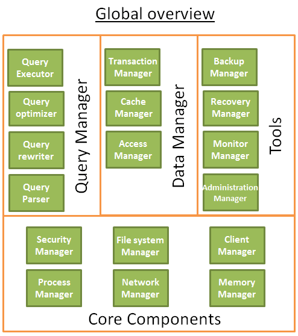
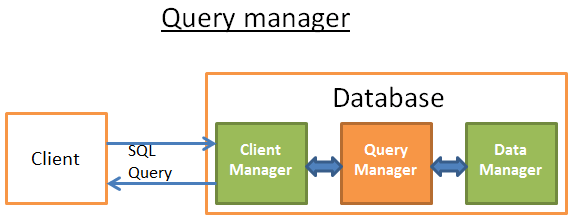

# 关系型数据库如何运行

当提到关系数据库，不由自主地认为缺少了些重要信息。这些数据库无所不在，发挥着他们的作用，他们包括了小巧的sqlite,强大的Teradat。但是少有文章去说明数据的运行原理。你可以搜索 “how does a relational database work”【关系数据库运行原理】来了解这样的文章有多么少。如果你去搜索现在这些流行技术（大数据，Nosql和javascript），你会找到大量深入的文章在说明这些技术的运行原理。关系数据库太不流行太没意思，以至于出了大学课堂，就找不到书和研究资料去阐明它的运行原理？ 

作为一个开发者，我非常不喜欢用一些我不理解的技术/组件。即使数据库已经经过了40年运用的检验，但是我依然不喜欢。这些年，我花费了上百小时的时间去研究这些每天都用的奇怪的黑匣子。**关系型数据库**的有趣也因为他门构建在**有效和重用的理念**上。如果你要了解数据库，而有没有时间或者没有毅力去了解这个宽泛的话题，那么你应该阅读这篇文章。 

虽然文章标题已经足够明确，**本文的目的不是让你学习怎么使用一个数据库**.但是,**你应该已经知道怎么写一个简单的联合查询和基本的增删改查的查询**，否则，你就不能明白本文。**这就是现在必须要知道**，我将解释为什么需要这些提前的知识。 

我将从时间复杂度开始开始这些计算机科学知识。当然当然，我晓得有些朋友不喜欢这些观点但是不了解这些，我们就不明白数据库中使用的技巧。这是一个庞大的话题，我将**聚焦于**非常必要的知识上，**数据库处理SQL查询的方法**。我将只涉及**数据库背后的基本观念**，让你在本文结束的时候**了解水面下发生了什么**。 

这是一篇又长又有技术性的文章，涉及了很多算法和数据结构，总之不怎么好理解，慢慢看吧同学。其有一些观点确实不容易理解，你把它跳过去也能得到一个比较全面的理解（译者注：这篇博文对于学习过《数据结构》的同学，不算是很难，即使有一些难以理解的观点，要涉及技术的特性，这是使用这些许技的原因，对应能够明白使用技术要达成的结果）。 

本文大体分为3个部分，为了方便理解：
*   底层技术和数据库模块
*   查询优化技术
*   事物和内存池管理

##总体结构

我们已经理解了数据库使用的基本组件。我们需要回头看看这个大结构图。 
数据库就是一个文件集合，而这里信息可以被方便读写和修改。通过一些文件，也可以达成相同的目的（便于读写和修改）。事实上，一些简单的数据库比如SQLite就仅仅使用了一些文件。但是SQLite是一些经过了良好设计的文件,因为它提供了以下功能： 
+   使用事务能够保证数据安全和一致性
+   即使处理百万计的数据也能高效处理

一般而言，数据库的结构如下图所示:
 

 
在开始写之前，我曾经看过很多的书和论文，而这些资料都从自己的方式来说明数据库。所以，清不要太过关注我怎么组织数据库的结构和对这些过程的命名，因为我选择了这些来配置文章的规划。不管这些不同模块有多不一样，但是他们总体的观点是**数据库被划分为多个相互交互的模块**。 

<u>核心模块:</u>
+  **进程管理器**: 很多的数据库都有进程/线程池需要管理，另外，为了达到纳秒级（切换），一些现代的数据库使用自己实现线程而不是系统线程。
+  **网络管理器**: 网络IO是一个大问题，尤其是分布式数据库。这就是一些数据库自己实现管理器的原因。
+  **文件系统管理器: 磁盘IO是数据库的第一性能瓶颈**。文件系统管理器太重要了，他要去完美使用OS文件系统，甚至自己取而代之。
+  **内存管理器**: 为了避免磁盘IO带来是惩罚，我们需要很大的内存。但是为了有效的使用这些内存，你需要一个有效率的内存管理器。尤其在多个耗内存的查询操作同时进行的时候。
+  **安全管理器**: 为了管理用户的验证和授权。
+  **客户端管理器**: 为了管理客户端连接..
+  .......

<u>工具类:</u>
+  **备份工具**: 保存和恢复一个数据库。
+  **恢复工具**: 使据据库在崩溃重启之后，重新达到一致性的状态。
+  **监控工具**: 记录数据库所有的行为，需要提供一个监控工具去监控数据库。
+  **管理工具**: 保存元数据（比如表的结构和名字），并提供工具去管理数据库，模式，表空间等等。
+  ......

<u>查询管理器:</u>
+  **查询解析器**: 确认查询是否合法
+  **查询重写器**: 优化查询的预处理
+  **查询优化器**: 优化查询语句
+  **查询执行器**: 编译执行一个查询
+  ......

<u>数据管理器:</u>
+  **事务管理器**: 管理事务
+  **缓存管理器**: 在使用数据或者修改数据之前，将数据载入到内存，
+  **数据访问**: 访问磁盘上数据

本文剩下部分，我将关注于数据库如何处理SQL查询的过程：
+  客户端管理器
+  查询管理器
+  数据管理器（我也将在这里介绍恢复管理工具）

##客户端管理器
 

 
客户端管理器是处理和客户端交互的部分。一个客户端可能是（网页）服务器或者终端用户或者终端程序。客户端管理器提供不同的方法（广为人知的API: JDBC, ODBC, OLE-DB）来访问数据库。
当然它也提供数据库特有的数据库APIs。
 
 
当我们连接数据库：
+  管理器首先验证我们的身份（通过用户名和密码）接着确认我们是否有使用数据库的授权，这些访问授权是你们的DBA设置的。
+  接着，管理器确认是否有空闲的进程(或者线程)来处理你的这次请求。
+  管理器也要确认数据库是否过载。
+  管理器在得到请求的资源（进程/线程）的时候，当等待超时，他就关闭这个连接，并返回一个易读的出错信息。
+  得到进程/线程之后，就**把这个请求传递给查询管理器**，这次请求处理继续进行。
+  查询过程不是一个all or nothing的过程，当从查询管理器获取数据之后，就立刻将**这些不完全的结果存到内存中，并开始传送数据**。

+  当遇到失败，他就中断连接，返回给你一个**易读的说明**，并释放使用到的资源。

 
 

##查询管理器

 
**这部分是数据库的重点所在**。在本节中，一个写的不怎么好的查询请求将转化成一个**飞快**执行指令代码。接着执行这个指令代码，并返回结果给客户端管理器。这是一个多步骤的操作。
+  查询语句将被**解析**，看它是否有效。
+  接着在它之上去除无用的操作语句，并添加与处理语句，重写出来。
+  为了优化这个查询，提供查询性能，将它转化成一个可执行的数据访问计划。
+  编译这个计划。
+  最后，执行它。
 
这部分，我不打算就爱那个很多在最后两点上，因为他们不是那么重要。
 
 

阅读完这部分之后，你将容易理解我推荐你读的这些材料：
 

+  The initial research paper (1979) on cost based optimization: . This article is only 12 pages and understandable with an average level in computer science.

+  A very good and in-depth presentation on how DB2 9.X optimizes queries 

+  A very good presentation on how PostgreSQL optimizes queries . It’s the most accessible document since it’s more a presentation on “let’s see what query plans PostgreSQL gives in these situations“ than a “let’s see the algorithms used by PostgreSQL”.

+  The official  about optimization. It’s “easy” to read because SQLite uses simple rules. Moreover, it’s the only official documentation that really explains how it works.

+  A good presentation on how SQL Server 2005 optimizes queries 

+  A white paper about optimization in Oracle 12c 

+  2 theoretical courses on query optimization from the authors of the book “DATABASE SYSTEM CONCEPTS”  and . A good read that focuses on disk I/O cost but a good level in CS is required.

+  另一个  that I find more accessible but that only focuses on join operators and disk I/O.

## 查询解析器
解析器会将每一条SQL语句检验，查看语法正确与否。如果你在SQL语句中犯了一些错误，解析器将阻止这个查询。比如你将"SELECT...."写成了"SLECT ...."，这次查询就到此为止了。
 
说的深一点，他会检查关键字使用前后位置是否正确。比如阻止WHERE 在SELECT之前的查询语句。
 
之后，查询语句中的表名，字段名要被解析。解析器就要使用数据库的元数据来验证：

+  **表**是否存在
+  表中**字段**是否存在
+  根据字段的类型，对字段的**操作可以**（比如你不能将数字和字符串进行比较，你不能针对数字使用substring()函数）

 
 

之后确认你是否有**权限**去读/写这些表。再次说明，DBA设置这些读写权限。
在解析过程中，SQL查询语句将被转换成一个数据库内一种表示(????)(一般是树 译者注：ast)
如果一切进行顺利，之后这种表示将会传递给查询重写器

## 查询重写器
在这一步，我们已经得到了这个查询内部的表示。重写器的目的在：
+  预先优化查询
+  去除不必要的操作
+  帮助优化器找到最佳的可行方案

 
重写器执行一系列广为人知的查询规则。如果这个查询匹配了规则的模型，这个规则就要生效，同时重写这个查询。下列有几个(可选的)规则：

+  **视图合并：**如果你在查询仲使用了一个视图，这个视图将会被翻译成视图的SQL代码。
+  **子查询整理**：如果查询仲有子查询非常难以优化，冲洗器可能会去除这个查询的子查询。

例子如下：
>   SELECT PERSON.*
>   FROM PERSON
>   WHERE PERSON.person_key IN
>   (SELECT MAILS.person_key
>   FROM MAILS
>   WHERE MAILS.mail LIKE 'christophe%');

将会改写成：
>   SELECT PERSON.*
>   FROM PERSON, MAILS
>   WHERE PERSON.person_key = MAILS.person_key
>   and MAILS.mail LIKE 'christophe%';

 
+  **去除非必须操作符**： 比如如果你想让数据唯一，而使用DISTINCT的与此同时还使用一个UNIQUE约束。这样DISTINCT关键字就会被去除。
+  **消除重复联合**：如果查询中有两个一样的join条件，无效的join条件将被移除掉。造成两个一样join的原因是一次join的条件隐含在(view)视图中，也可能是因为传递性。
+  **确定的数值计算：** 如果你写的查询需要一些计算，那么这些计算将在重写过程。去个例子"WHERE AGE > 10 + 2"将会转换成 "WHERE AGE > 12"，TODATE("some date")将转化成datetime格式的日期。
+  "(高端功能)分区选择:？？" 如果你正在使用一个分过去的表，冲洗器会找到你要使用哪一个分区。
+  "(高端功能)实体化视图:"如果你的查询语句实体化视图

这时候，重写的查询传递给查询优化器。
好戏开场了。

